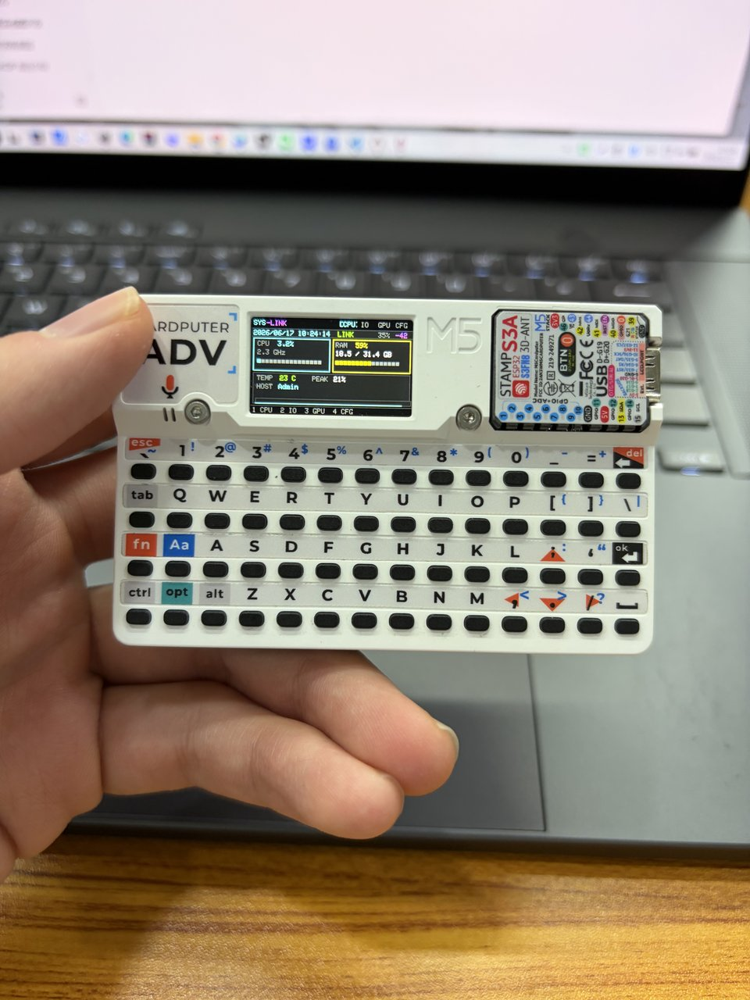
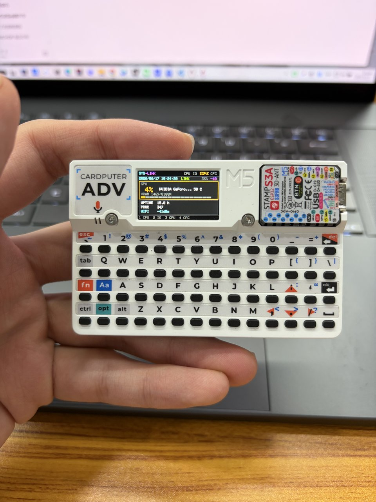
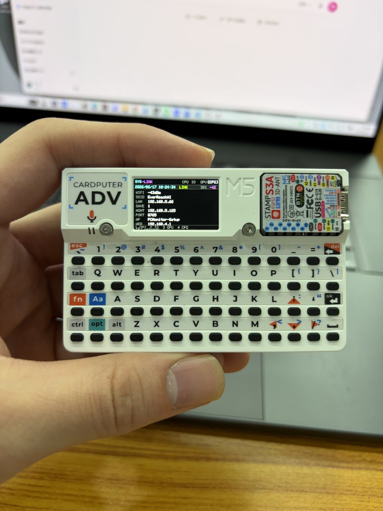

# Cardputer PC Monitor / Cardputer 电脑监控

[English](README.md) | **中文**

通过 Wi‑Fi 在 **M5Stack Cardputer Adv** 上监控 **Windows 电脑** — CPU、内存、磁盘、网络，可选 GPU 与 CPU 温度。

<p align="center">
  
  
</p>
<p align="center">
  
  
</p>

## 功能

- **Wi‑Fi 监控** — 配网后无需 USB 线
- **PC Agent** — 轻量 Python 服务（端口 **8765**，`GET /stats`）
- **Web 配网门户** — 连接 Wi‑Fi 并填写电脑 IP
- **CPU 温度（可选）** — LibreHardwareMonitor HTTP
- **GPU（可选）** — NVIDIA + `nvidia-smi`
- **一键 PC 部署** — 防火墙、开机自启、LHM 看门狗

## 环境要求

| 组件 | 是否必须 |
|------|----------|
| M5Stack **Cardputer Adv** | 是 |
| **Windows 10/11** 电脑（同一局域网） | 是 |
| Python **3.10+**（安装时勾选 Add to PATH） | 是 |
| VS Code + PlatformIO（烧录固件） | 是 |
| LibreHardwareMonitor | 可选（CPU 温度） |
| NVIDIA 显卡 + 驱动 | 可选（GPU 页） |

## 快速开始

### 1. 电脑端 — 一次配置

```bat
git clone https://github.com/wangyu123554/cardputer-pc-monitor.git
cd cardputer-pc-monitor
```

**右键「以管理员身份运行」→ `setup_pc_once.bat`**

会自动完成：

1. 安装 Python 依赖（`psutil`）
2. 防火墙放行 **8765**
3. Agent 后台运行 + **开机自启**
4. （可选）安装/配置 **LibreHardwareMonitor** + 看门狗
5. 显示 **局域网 IP**（配网要用）

电脑验证：浏览器打开 `http://127.0.0.1:8765/stats`

### 2. 烧录固件

VS Code 打开本项目 → PlatformIO → 环境 **`m5stack-cardputer`** → **Upload**

### 3. Cardputer 配网

1. 连接 Wi‑Fi 热点 **`PCMonitor-Setup`**
2. 浏览器打开 **http://192.168.4.1**
3. 填写 Wi‑Fi 账号密码 + 电脑 **Agent IP** + 端口 **8765**

## 最小安装（不自启 / 不要温度）

```bat
pip install -r requirements.txt
run_agent.bat
```

再烧录固件并配网。不装 LHM 时 CPU 温度显示 `--`，其余功能正常。

## 功能说明

| 数据 | 来源 | 没有时会怎样 |
|------|------|----------------|
| CPU / 内存 / 磁盘 / 网络 | psutil（Agent） | 检查 Agent / 防火墙 |
| CPU 温度 | LibreHardwareMonitor `:8090` | 显示 `--` |
| GPU | `nvidia-smi` | GPU 页 N/A |
| 开机自启 | `setup_pc_once.bat` | 手动运行 `run_agent.bat` |

## 按键

| 键 | 页面 |
|----|------|
| **1** | CPU / 内存 / 温度 |
| **2** | 磁盘 / 网络 / 磁盘 IO |
| **3** | GPU / 系统信息 |
| **4** | 设置 |
| **R** | 刷新（设置页） |
| **Del / Esc** | 回到首页 |

状态栏：**日期时间 · LINK（已连接）/ DOWN（断开）· 电量 · WiFi**

## PC 脚本

| 脚本 | 用途 |
|------|------|
| `setup_pc_once.bat` | **推荐** — 一键完整配置 |
| `run_agent.bat` | 调试（有窗口） |
| `restart_agent.bat` | 重启 Agent |
| `install_autostart.bat` | 仅 Agent 自启 |
| `install_lhm_autostart.bat` | 仅 LHM + 看门狗 |
| `uninstall_all.bat` | 取消所有自启 |
| `open_firewall.bat` | 仅防火墙 |

## 目录结构

```
cardputer-pc-monitor/
├── src/                 # Cardputer 固件（ESP32-S3）
├── platformio.ini
├── pc_monitor_agent.py  # Windows Agent
├── setup_pc_once.bat    # 电脑一键配置
├── requirements.txt
└── docs/
    ├── TROUBLESHOOTING.md
    └── images/          # 截图
```

## 常见问题

见 [docs/TROUBLESHOOTING.zh-CN.md](docs/TROUBLESHOOTING.zh-CN.md)

## 许可证

MIT — 见 [LICENSE](LICENSE)
